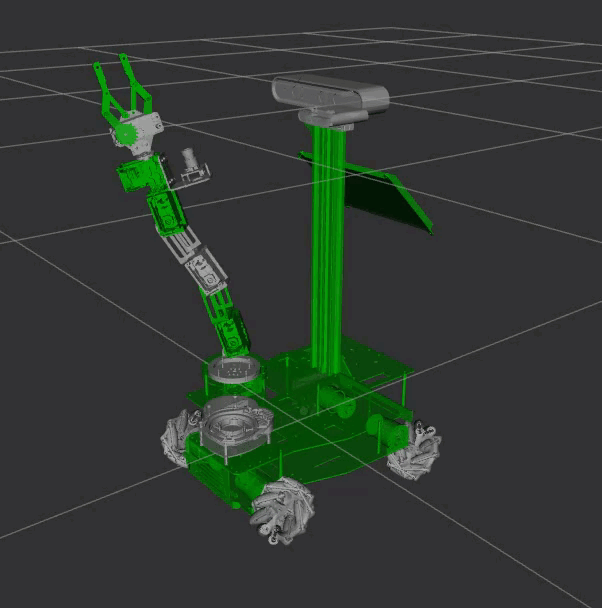

# X3Plus robot description

ROS 2 description of X3 Plus robot

>**Note:** This repository is still under construction

## Starting commands

### Adding keyboard teleoperation
One of the first possibilities to control a definitions of a robot is to operate it remotely with a teleoperation. There is a package which converts console input into twist messages. Note that the command with the default topic will be mapped to the robot topic.

ros2 run  teleop_twist_keyboard teleop_twist_keyboard --ros-args --remap cmd_vel:=master3_drive/cmd_vel
